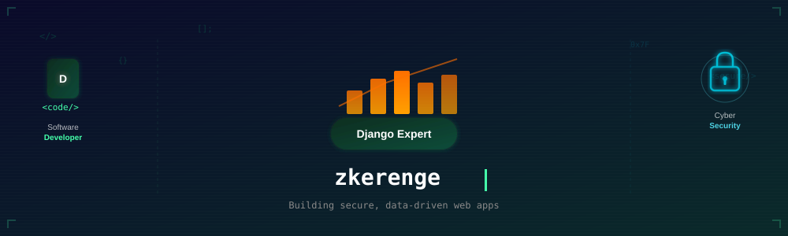

<div align="center">
  
</div>

<br>

## 🔧 Tech Stack

<div align="center">
  
  ### Software Development
  
  
  
  

  ### Data Science
  
  
  

  ### Cybersecurity
  
  
  

</div>

---

## 📊 GitHub Analytics

<div align="center">
  
  
</div>

---

## 🎯 Current Focus

```python
# What zkerenge is building right now
focus = {
    "framework": "Django 5.0",
    "data_tool": "Pandas + Matplotlib",
    "security": "OWASP Top 10 + JWT hardening"
}
print("Code • Analyze • Secure")
